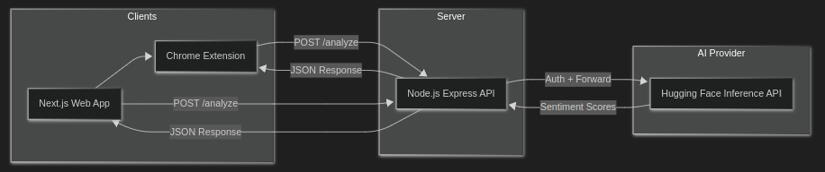

# PS-2025 — Social Media Sentiment Analyzer


Lightweight web app, a Chrome extension, and a backend that analyze short text and social posts for sentiment using Hugging Face models.

---

## What it does
- Web UI (Next.js): paste or enter text and get sentiment (Positive / Neutral / Negative) with confidence scores.
- Browser Extension (Manifest V3): automatically analyzes posts on X (formerly Twitter) and adds a color-coded border + percentage summary for each post.
- Backend (Express): proxies requests to the Hugging Face Inference API so the UI & extension don't need direct HF keys.

---

## Quick Demo


---

## Features
- Real-time sentiment detection (web app + extension)
- Simple cache (extension background) to avoid duplicate network calls
- Easy to run locally and to deploy (Railway/Vercel recommended)

---

## Quick start — Local development
1. Clone the repo

```bash
git clone https://github.com/localhost969/ps-2025.git
cd ps-2025
```

2. Backend

```bash
cd backend
npm install
# Create a .env file with the following:
# HF_TOKEN=<Your Hugging Face token>
npm start
```

3. Frontend

```bash
cd ../frontend
npm install
# If you want to point the frontend to a local backend, edit
# `frontend/pages/index.tsx` and set the fetch URL to: `http://localhost:5000/analyze`
npm run dev
```

4. Chrome Extension (developer mode)

```bash
cd ../extension

# Open Chrome -> chrome://extensions -> Enable 'Developer mode' -> Load unpacked -> select this `extension` folder
```

---

## System Architecture



Data Flow:
1. Input: Raw text is captured from the textarea (Web) or DOM elements (Extension).
2. Processing: Text is packaged into a JSON payload `{ "text": "..." }`.
3. Analysis: Backend forwards this to Hugging Face, which returns an array of labels and scores.
4. Output: The application sorts these scores and renders the highest confidence label to the user.

---

## Production / Deployment notes
- Backend: already configured to bind to env vars and ready to deploy to Railway. Set `HF_TOKEN` in env.
- Frontend: built with Next.js - change the backend URL to your production backend when deploying, or use an env variable workflow.

---

## Where to look
- Frontend: `frontend/` (Next.js) — main page is `pages/index.tsx`
- Backend: `backend/` (Express) — REST endpoint `POST /analyze`
- Extension: `extension/` — content script & service worker (+ css)

---

## Troubleshooting
- If the app returns an HF token error: ensure `HF_TOKEN` is set in your backend `.env` file.
- If extension or web app can't reach the backend: either update the `BACKEND_URL` in `extension/background.js` or set the fetch URL in `pages/index.tsx` to your local backend URL.

---

## Contributing
- Improvements, small fixes, and PRs are welcome.