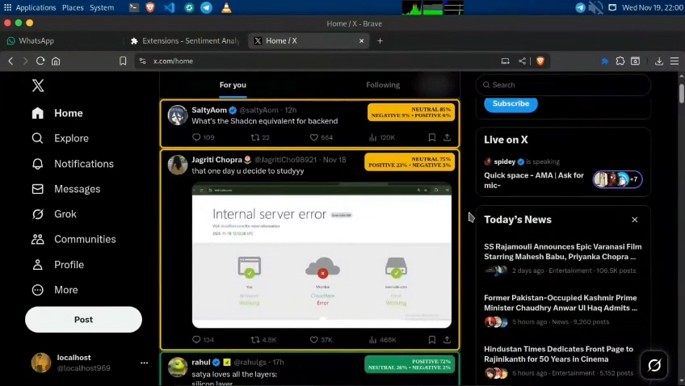

# Twitter Sentiment Analysis

## Installation Instructions

To install this Chrome extension for Twitter Sentiment Analysis:

1. **Clone the Repository or Download as ZIP**:
    - Clone the repo: `git clone https://github.com/localhost969/ps-2025.git`
    - Or download the ZIP file from the GitHub repository and extract it to a local folder.

2. **Load the Extension in Chrome**:
    - Open Chrome and navigate to `chrome://extensions/`.
    - Enable "Developer mode" in the top right corner.
    - Click "Load unpacked" and select only the `extension` folder inside the cloned/downloaded repository (not the entire repo folder).

3. **Test the Extension**:
    - Visit [x.com](https://x.com) (formerly Twitter) to test the sentiment analysis features live.

